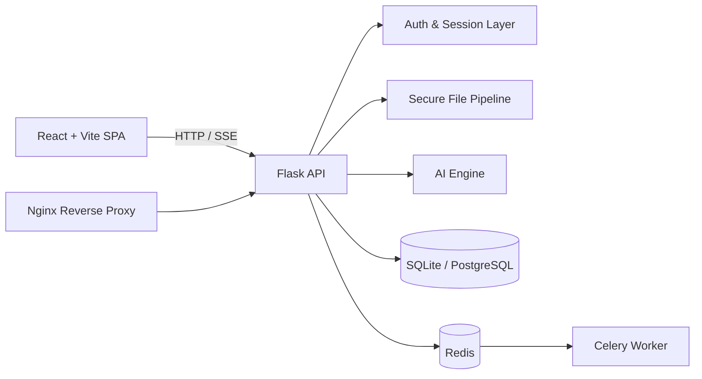

<p align="center">
  
</p>

<h1 align="center">ReMind</h1>

<p align="center">
  AI-платформа для общения с LLM, работы с историей чатов, мультимодальными вложениями и расширенной безопасностью.
</p>

<p align="center">
  <a href="https://github.com/SynvexAI/ReMind/actions/workflows/ci.yml"></a>
  <a href="LICENSE"></a>
  <a href="https://github.com/SynvexAI/ReMind/issues"></a>
  <a href="https://github.com/SynvexAI/ReMind/stargazers"></a>
  <a href="https://github.com/SynvexAI/ReMind/pulls"></a>
</p>

## О проекте

ReMind объединяет backend на Flask и frontend на React/Vite в единое приложение с акцентом на:

- безопасную обработку пользовательских запросов и файлов;
- удобную работу с сессиями и историей диалогов;
- потоковый ответ модели (SSE);
- готовность к production-развертыванию через Docker Compose.

Текущий статус: `beta`.

## Навигация

- [Основные возможности](#основные-возможности)
- [Технологический стек](#технологический-стек)
- [Архитектура](#архитектура)
- [Быстрый старт](#быстрый-старт)
- [Запуск в Docker](#запуск-в-docker)
- [Конфигурация окружения](#конфигурация-окружения)
- [API (кратко)](#api-кратко)
- [Качество и процессы](#качество-и-процессы)
- [Структура репозитория](#структура-репозитория)
- [Известные технические ограничения](#известные-технические-ограничения)
- [Лицензия](#лицензия)

## Основные возможности

- Чат с AI-моделью через `/chat` с поддержкой streaming/SSE.
- Управление сессиями и историями (`/sessions`, `/sessions/<id>/history`).
- Публичный/приватный доступ к чатам и share-ссылки (`/sessions/<id>/share`, `/c/<public_id>`).
- Встроенная auth-система: регистрация, вход, профиль, настройки, избранное.
- OAuth через Google (при наличии ключей).
- Безопасная загрузка файлов: валидация имени, MIME-типа и содержимого.
- Перевод текста (`/translate`) и синтез речи (`/synthesize`).
- GDPR-операции: экспорт и удаление пользовательских данных.
- Мультиязычный интерфейс (локали в `src/i18n/locales`).

## Технологический стек

| Слой | Технологии |
|---|---|
| Frontend | React 19, TypeScript, Vite 7, i18next, Chart.js, D3, Mermaid |
| Backend | Python 3.11, Flask, Flask-SQLAlchemy, Flask-Session, Authlib |
| AI / Integrations | Gemini API, gTTS |
| Data / Queue | SQLite/PostgreSQL, Redis, Celery |
| Infra | Docker, Docker Compose, Nginx |
| CI | GitHub Actions (`.github/workflows/ci.yml`) |

## Архитектура



Ключевые точки входа:

- `app_factory.py`: сборка и конфигурация Flask-приложения.
- `routes/api.py`: chat/session/media/privacy API.
- `utils/auth.py`: auth endpoints, user profile/settings.
- `src/`: клиентская SPA-часть.

## Быстрый старт

### 1. Клонирование

```bash
git clone https://github.com/SynvexAI/ReMind.git
cd ReMind
```

### 2. Установка зависимостей

PowerShell (Windows):

```powershell
python -m venv .venv
.\.venv\Scripts\Activate.ps1
pip install -r requirements.txt
npm ci
Copy-Item .env.example .env
```

Bash (Linux/macOS):

```bash
python3 -m venv .venv
source .venv/bin/activate
pip install -r requirements.txt
npm ci
cp .env.example .env
```

### 3. Настройка `.env`

Минимум для локального запуска:

- `SECRET_KEY`
- `GEMINI_API_KEY` (если нужен production-like AI/перевод)
- `REDIS_URL`

### 4. Запуск backend

```bash
python main.py
```

Backend по умолчанию стартует на `http://127.0.0.1:5000`.

### 5. Запуск frontend в dev-режиме

```bash
npm run dev
```

## Запуск в Docker

### 1. Подготовьте `.env`

Обязательно задайте:

- `SECRET_KEY`
- `GEMINI_API_KEY`
- `DB_PASSWORD`

### 2. Запуск

```bash
docker compose up --build
```

Контейнеры:

- `nginx` (80/443)
- `app` (Flask)
- `worker` (Celery)
- `db` (PostgreSQL)
- `redis` (Redis)

## Конфигурация окружения

Основные переменные (`.env.example`):

| Переменная | Назначение |
|---|---|
| `SECRET_KEY` | Ключ подписи сессий и CSRF |
| `GEMINI_API_KEY`, `GEMINI_MODEL_NAME` | AI-провайдер |
| `DATABASE_URL` | Подключение к базе |
| `REDIS_URL` | Session storage / limiter storage |
| `CELERY_BROKER_URL`, `CELERY_RESULT_BACKEND` | Очередь фоновых задач |
| `GOOGLE_CLIENT_ID`, `GOOGLE_CLIENT_SECRET` | Google OAuth |
| `TURNSTILE_SITE_KEY`, `TURNSTILE_SECRET_KEY` | Cloudflare Turnstile |
| `CORS_ORIGINS` | Разрешенные origin'ы |
| `VALIDATE_USER_AGENT` | Проверка User-Agent |
| `ALLOW_GUEST_CHATS_SAVE` | Разрешение сохранения гостевых сессий |

## API (кратко)

| Группа | Эндпоинты |
|---|---|
| Chat | `POST /chat` |
| Sessions | `GET/POST /sessions`, `GET /sessions/<id>/history`, `POST /sessions/<id>/share`, `DELETE /sessions/<id>` |
| Auth/Profile | `/api/auth/*`, `/api/user/*`, `/api/chat-history*` |
| Tools | `POST /translate`, `POST /synthesize`, `POST /get-link-metadata` |
| Health | `GET /health` |
| Privacy | `GET /api/privacy/export`, `POST /api/privacy/delete` |

## Качество и процессы

Репозиторий оформлен в production-friendly формате:

- [Contributing Guide](CONTRIBUTING.md)
- [Security Policy](SECURITY.md)
- [Code of Conduct](CODE_OF_CONDUCT.md)
- [Support Guide](SUPPORT.md)
- [Governance](GOVERNANCE.md)
- [Pull Request Template](.github/pull_request_template.md)
- [Issue Templates](.github/ISSUE_TEMPLATE/)
- [CODEOWNERS](.github/CODEOWNERS)
- [Changelog](docs/CHANGELOG.md)
- [Architecture Notes](docs/ARCHITECTURE.md)
- [Roadmap](docs/ROADMAP.md)
- [Release Process](docs/RELEASE_PROCESS.md)

Базовые проверки в CI:

- secret pattern scan (tracked files)
- frontend lint (`npm run lint`)
- frontend build (`npm run build`)
- Python syntax check (`py_compile`)

## Структура репозитория

```text
ReMind/
  .github/             # workflow + issue/PR templates + codeowners
  ai_engine/           # AI-провайдеры и логика генерации
  routes/              # API blueprint
  services/            # файлы, voice, tasks
  utils/               # auth, security, csrf, privacy, rate limiting
  src/                 # React/TypeScript frontend
  public/              # статика
  migrations/          # миграции БД
  docs/                # changelog и проектная документация
```

## Известные технические ограничения

- В CI пока нет полноценных unit/integration/e2e тестов.

## Лицензия

Проект распространяется под **GNU AGPLv3**. Подробности: [LICENSE](LICENSE).
