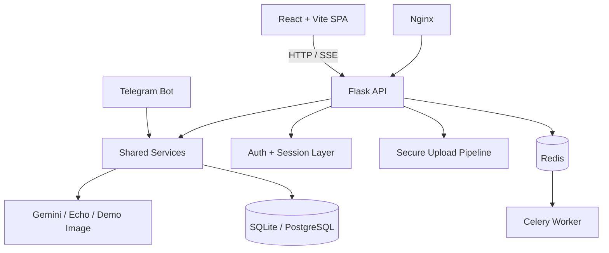

<h1 align="center">ReMind</h1>

<p align="center">
  
</p>

<p align="center">
  <strong>Full-stack AI chat platform with streaming replies, secure file handling, shared sessions, privacy controls, and a production-ready Flask + React stack.</strong>
</p>

<p align="center">
  <a href="https://github.com/ReNothingg/ReMind/actions/workflows/ci.yml"></a>
  <a href="LICENSE"></a>
  
  <a href="https://github.com/ReNothingg/ReMind/issues"></a>
  <a href="https://github.com/ReNothingg/ReMind/stargazers"></a>
</p>

<p align="center">
  
  
  
  
  
</p>

<p align="center">
  <a href="#overview">Обзор</a> •
  <a href="#features">Возможности</a> •
  <a href="#quick-start">Быстрый старт</a> •
  <a href="#docker">Docker</a> •
  <a href="#quality">Качество</a> •
</p>

<p align="center">
  
</p>

<a id="overview"></a>

## Обзор

ReMind это full-stack AI-приложение с React/Vite frontend, Flask API, очередями на Celery и инфраструктурой под Docker Compose. Репозиторий собран не как демо-лендинг, а как рабочая база для продукта: сессии, шаринг чатов, авторизация, приватность, observability, OpenAPI, тесты и security-проверки уже лежат в одном месте.

Проект сейчас в статусе `beta`. Он включает:

- веб-интерфейс для диалога с AI-моделями;
- backend с SSE-стримингом, историей чатов и приватными/public share-ссылками;
- безопасную загрузку файлов и медиа-обработку;
- Telegram bot, использующий тот же сервисный слой;
- CI/CD-проверки, health/metrics endpoints и deployment через Docker Compose.

## Что уже есть в репозитории

| Область | Что внутри |
|---|---|
| Web app | React 19, TypeScript, Vite 7, guest/auth режимы, мультиязычность, модальные окна, виджеты, медиа-просмотр |
| API | Flask, SSE-чат, auth/profile/settings, sessions, privacy export/delete, OpenAPI contract |
| Security | CSRF, rate limiting, secure uploads, security headers, user-agent validation, audit logging |
| AI layer | `gemini`, локальный `echo` для smoke-тестов, `demo_image` для проверки image pipeline |
| Background jobs | Redis + Celery worker |
| Operations | Nginx, Dockerfile, Docker Compose, health page, `/metrics`, GitHub Actions, security gate |
| Extensions | Telegram bot на `aiogram` |

<a id="features"></a>

## Возможности

- Потоковый AI-чат через `POST /chat` с SSE-ответами.
- История диалогов, список сессий, удаление и восстановление контекста.
- Публичные read-only ссылки на чаты через `/sessions/<id>/share` и `/c/<public_id>`.
- Guest mode и auth mode в одном приложении.
- Регистрация, логин, профиль, настройки, избранное и Google OAuth.
- Безопасная загрузка файлов с валидацией имени, MIME-типа и содержимого.
- Перевод текста и синтез речи через отдельные API endpoints.
- Privacy flows: экспорт и удаление пользовательских данных.
- HTML/JSON health-check страница и Prometheus metrics.
- Telegram bot для работы с тем же chat service.

## Технологический стек

| Слой | Технологии |
|---|---|
| Frontend | React 19, TypeScript, Vite 7, i18next, Chart.js, D3, Mermaid, Nomnoml |
| Backend | Python 3.11, Flask, Flask-SQLAlchemy, Flask-Session, Authlib, Waitress, Gunicorn |
| AI / Media | Gemini API, Pillow, gTTS |
| Storage / Queue | SQLite или PostgreSQL, Redis, Celery |
| Infra | Docker, Docker Compose, Nginx |
| Quality | Ruff, Black, MyPy, Pytest, Vitest, Playwright, GitHub Actions |

## Архитектура


```mermaid
graph TD
  UI[React + Vite SPA] -->|HTTP / SSE| API[Flask API]
  TG[Telegram Bot] --> SRV[Shared Services]
  API --> SRV
  API --> AUTH[Auth + Session Layer]
  API --> FILES[Secure Upload Pipeline]
  SRV --> AI[Gemini / Echo / Demo Image]
  SRV --> DB[(SQLite / PostgreSQL)]
  API --> REDIS[(Redis)]
  REDIS --> CELERY[Celery Worker]
  NGINX[Nginx] --> API
```

Ключевые точки входа:

- `app_factory.py` собирает Flask-приложение и middleware/безопасность.
- `routes/features/` содержит feature-oriented API модули.
- `services/` и `ai_engine/` держат историю, файлы, voice и adapters к моделям.
- `src/` это клиентская SPA.
- `telegram_bot/` использует тот же backend/service слой.

<a id="quick-start"></a>

## Быстрый старт

### Требования

- Python `3.11`
- Node.js `20+`
- Redis `7+`
- Git
- `GEMINI_API_KEY` для Gemini, перевода и основного AI-флоу

### 1. Клонирование

```bash
git clone https://github.com/ReNothingg/ReMind.git
cd ReMind
```

### 2. Установка зависимостей

PowerShell:

```powershell
python -m venv .venv
.\.venv\Scripts\Activate.ps1
pip install -r requirements.txt
npm ci
Copy-Item .env.example .env
```

Bash:

```bash
python3 -m venv .venv
source .venv/bin/activate
pip install -r requirements.txt
npm ci
cp .env.example .env
```

### 3. Настройка `.env`

Минимум для локального старта:

- `SECRET_KEY`
- `REDIS_URL`
- `CELERY_BROKER_URL`
- `CELERY_RESULT_BACKEND`
- `GEMINI_API_KEY` для Gemini-сценариев

Если вы запускаете локальный Redis без пароля, удобно сразу заменить значения из `.env.example` на:

```env
REDIS_URL=redis://localhost:6379/0
CELERY_BROKER_URL=redis://localhost:6379/1
CELERY_RESULT_BACKEND=redis://localhost:6379/1
```

Если `GEMINI_API_KEY` пока нет, для локального smoke-теста UI и стриминга можно использовать модели `echo` и `demo_image`.

### 4. Запуск backend

```bash
python main.py
```

Backend поднимается на `http://127.0.0.1:5000`.

### 5. Запуск frontend

```bash
npm run dev
```

Vite dev server работает на `http://127.0.0.1:5173` и проксирует API на backend.

### 6. Дополнительно

Celery worker:

```bash
celery -A celery_worker.celery worker --loglevel=info --concurrency=2
```

Telegram bot:

```bash
python -m telegram_bot
```

Требуется `TELEGRAM_BOT_TOKEN`.

<a id="docker"></a>

## Docker Compose

Для полного production-like запуска в репозитории уже есть `Dockerfile`, `docker-compose.yml` и `nginx.conf`.

### Что нужно задать в `.env`

- `SECRET_KEY`
- `DB_PASSWORD`
- `REDIS_PASSWORD`
- `GEMINI_API_KEY`

### Запуск

```bash
docker compose up --build
```

Поднимутся сервисы:

- `nginx`
- `app`
- `worker`
- `db`
- `redis`

Это основной путь для проверки полной связки: Flask API, статика frontend-сборки, PostgreSQL, Redis и Celery.

## Конфигурация окружения

| Переменная | Назначение |
|---|---|
| `SECRET_KEY` | Подпись сессий, CSRF и внутренние токены |
| `DATABASE_URL` | SQLite/PostgreSQL для приложения |
| `REDIS_URL` | Redis для сессий, rate limiting и части runtime-инфраструктуры |
| `CELERY_BROKER_URL`, `CELERY_RESULT_BACKEND` | Конфигурация фоновых задач |
| `GEMINI_API_KEY`, `GEMINI_MODEL_NAME` | Основной AI provider |
| `GOOGLE_CLIENT_ID`, `GOOGLE_CLIENT_SECRET` | Google OAuth |
| `TURNSTILE_SITE_KEY`, `TURNSTILE_SECRET_KEY` | Cloudflare Turnstile |
| `BACKEND_URL` | Canonical backend URL для share links и redirect logic |
| `CORS_ORIGINS` | Разрешенные origin'ы |
| `ALLOW_GUEST_CHATS_SAVE` | Разрешает персистить гостевые чаты |
| `VALIDATE_USER_AGENT` | Включает проверку User-Agent паттернов |
| `TELEGRAM_BOT_TOKEN`, `TELEGRAM_BOT_DEFAULT_MODEL` | Telegram bot integration |

## Локальные и тестовые модели

| Модель | Для чего нужна |
|---|---|
| `gemini` | Основной production-oriented сценарий |
| `echo` | Быстрый smoke-test UI, SSE и истории без внешнего AI |
| `demo_image` | Проверка image flow без внешнего генератора |

Это удобно для локальной разработки, когда нужно прогнать UX и transport layer, не упираясь в внешний API.

## API и контракт

Полезные entrypoints:

- `POST /chat`
- `GET/POST /sessions`
- `GET /sessions/<id>/history`
- `POST /sessions/<id>/share`
- `GET /api/privacy/export`
- `POST /api/privacy/delete`
- `GET /health`
- `GET /metrics`
- `GET /openapi.json`

OpenAPI-спека лежит в [`openapi/openapi.json`](openapi/openapi.json), а TypeScript client генерируется в `src/generated/openapi.ts` через:

```bash
npm run openapi:check
```

<a id="quality"></a>

## Качество и CI

Репозиторий уже оформлен как нормальная рабочая база, а не как один файл `main.py`.

Для полного локального quality-run установите dev-зависимости:

```bash
pip install -r requirements/dev.txt -c requirements/constraints.txt
```

### Основные локальные проверки

```bash
ruff check .
black --check .
mypy app_factory.py routes utils services
pytest --cov=routes --cov=services --cov=utils --cov-report=term-missing --cov-fail-under=70
npm run typecheck
npm run openapi:check
npm run lint
npm run test:unit:coverage
npm run build
```

E2E:

```bash
npm run test:e2e:install
npm run test:e2e
```

### Что делает CI

- сканирует tracked files на очевидные секреты;
- гоняет Ruff, Black, MyPy и Pytest;
- проверяет frontend typecheck, lint, unit tests и build;
- запускает Playwright e2e;
- прогоняет security pipeline через `pip-audit`, `npm audit`, `bandit` и `semgrep`.

## Документы репозитория

- [Contributing Guide](CONTRIBUTING.md)
- [Security Policy](SECURITY.md)
- [Support Guide](SUPPORT.md)
- [Code of Conduct](CODE_OF_CONDUCT.md)
- [Governance](GOVERNANCE.md)
- [Pull Request Template](.github/pull_request_template.md)
- [Issue Templates](.github/ISSUE_TEMPLATE/)
- [CODEOWNERS](.github/CODEOWNERS)

<a id="structure"></a>

## Ограничения и текущее состояние

- Проект еще в `beta`, поэтому UX и часть внутренней архитектуры продолжают меняться.
- Без `GEMINI_API_KEY` основной AI-флоу будет ограничен, но локальные `echo` и `demo_image` остаются полезны для smoke-тестов.
- Для локальной разработки SQLite подходит нормально, но для shared/public deployment лучше использовать PostgreSQL + Redis.

## Лицензия

Проект распространяется под **GNU AGPLv3**. Подробности в [LICENSE](LICENSE).
