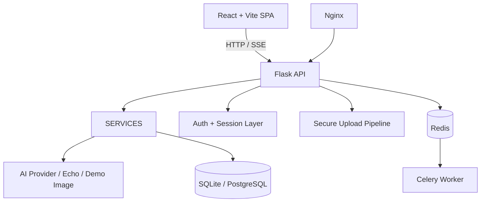

<div align="center">
  

  <h1>ReMind</h1>

  <p>
    <strong>ReMind — для всех. Даже для тех, кто ещё не понял зачем.</strong>
  </p>

  <p>
    <a href="https://github.com/ReNothingg/ReMind/actions/workflows/ci.yml"></a>
    <a href="LICENSE"></a>
    
    <a href="https://github.com/ReNothingg/ReMind/stargazers"></a>
    <a href="https://github.com/ReNothingg/ReMind/issues"></a>
  </p>

  <!-- ## ⭐ Звезды -->
  <p>
    
    
    
    
    
  </p>

  <p align="center">
    <a href="https://www.star-history.com/#ReNothingg/ReMind&type=date&legend=top-left">
      <picture>
        <source media="(prefers-color-scheme: dark)" srcset="https://api.star-history.com/svg?repos=ReNothingg/ReMind&type=date&theme=dark&legend=top-left" />
        <source media="(prefers-color-scheme: light)" srcset="https://api.star-history.com/svg?repos=ReNothingg/ReMind&type=date&legend=top-left" />
        
      </picture>
    </a>
  </p>

  <p>
    <a href="#overview">Обзор</a>
    · <a href="#features">Возможности</a>
    · <a href="#quick-start">Быстрый старт</a>
    · <a href="#docker">Docker</a>
    · <a href="#architecture">Архитектура</a>
    · <a href="#quality">Качество</a>
    · <a href="#license">Лицензия</a>
  </p>

  
</div>

<a id="stars"></a>

<!-- <a id="overview"></a> -->

## ✨ Обзор

**ReMind** это AI-приложение на React/Vite и Flask, собранное как продуктовая база: streaming chat, сохранение сессий, share-ссылки, авторизация, безопасные загрузки, privacy endpoints, OpenAPI-контракт, Celery worker и Docker Compose-инфраструктура лежат в одном репозитории.

Проект находится в статусе `beta`: основные пользовательские сценарии уже доступны, а UX и внутренняя архитектура продолжают развиваться.

| Что важно | Как это устроено |
|---|---|
| AI chat workspace | SSE-стриминг, история сообщений, session management, guest/auth режимы |
| Мультимодальность | File upload pipeline, image flow, voice synthesis, translate endpoint |
| Приватность | Экспорт данных, удаление аккаунта/данных, secure session handling |
| Production base | Nginx, PostgreSQL, Redis, Celery, health checks, metrics, CI/security gate |
| Extensibility | OpenAPI и shared services поверх общего backend layer |

<a id="features"></a>

## 🚀 Возможности

- Streaming AI chat через `POST /chat` с server-sent events.
- История диалогов, список сессий, удаление и восстановление контекста.
- Public read-only share links через `/sessions/<id>/share` и `/c/<public_id>`.
- Guest mode и auth mode в одном интерфейсе.
- Регистрация, логин, профиль, настройки, избранное и Google OAuth.
- Безопасная загрузка файлов с проверкой имени, MIME-типа и содержимого.
- Перевод текста и text-to-speech через отдельные API endpoints.
- Privacy flows: export/delete пользовательских данных.
- HTML/JSON health check, Prometheus-style `/metrics` и audit logging.

<a id="tech-stack"></a>

## 🧱 Технологический стек

| Слой | Стек |
|---|---|
| Frontend | React 19, TypeScript, Vite 7, i18next, Chart.js, D3, Mermaid, Nomnoml |
| Backend | Python 3.11, Flask, Flask-SQLAlchemy, Flask-Session, Authlib, Waitress, Gunicorn |
| AI / Media | AI provider adapter, local `echo`, `demo_image`, Pillow, gTTS |
| Storage / Queue | SQLite for local development, PostgreSQL for deployment, Redis, Celery |
| Infra | Docker, Docker Compose, Nginx |
| Quality | Ruff, Black, MyPy, Pytest, Vitest, Playwright, GitHub Actions |

<a id="quick-start"></a>

## ⚡ Быстрый старт

### Требования

- Python `3.11`
- Node.js `20+`
- Redis `7+`
- Git
- `AI_PROVIDER_API_KEY` для основного AI-сценария

### 1. Клонирование

```bash
git clone https://github.com/ReNothingg/ReMind.git
cd ReMind
```

### 2. Установка зависимостей

PowerShell:

```powershell
python -m venv .venv
.\.venv\Scripts\Activate.ps1
pip install -r requirements.txt
npm ci
Copy-Item .env.example .env
```

Bash:

```bash
python3 -m venv .venv
source .venv/bin/activate
pip install -r requirements.txt
npm ci
cp .env.example .env
```

### 3. Настройка `.env`

Минимальная полезная локальная конфигурация:

```env
SECRET_KEY=replace-with-a-long-random-secret
DATABASE_URL=sqlite:///database/users.db
REDIS_URL=redis://localhost:6379/0
CELERY_BROKER_URL=redis://localhost:6379/1
CELERY_RESULT_BACKEND=redis://localhost:6379/1
AI_PROVIDER_API_KEY=
AI_PROVIDER_MODEL_NAME=
```

`AI_PROVIDER_API_KEY` нужен для основного AI provider. Для локальных smoke-тестов UI, SSE и истории можно использовать встроенные `echo` и `demo_image`.

### 4. Запуск frontend + backend

```bash
npm run dev
```

Команда запускает:

| Сервис | URL |
|---|---|
| Flask API | `http://127.0.0.1:5000` |
| Vite dev server | `http://127.0.0.1:5173` |

Vite проксирует API-запросы на backend.

Если нужно запустить части отдельно:

```bash
npm run dev:backend
npm run dev:frontend
```

### 5. Дополнительные процессы

Celery worker:

```bash
celery -A celery_worker.celery worker --loglevel=info --concurrency=2
```

<a id="docker"></a>

## 🐳 Docker

В репозитории есть отдельные Compose-конфигурации для разработки и production-like проверки.

| Режим | Команда | Назначение |
|---|---|---|
| Dev | `docker compose -f docker-compose.dev.yml up --build` | Hot reload frontend, backend and worker |
| Dev shortcut | `npm run docker:dev` | Запуск dev Compose stack |
| Production-like | `docker compose up --build` | Nginx + Flask app + worker + PostgreSQL + Redis |

Dev URLs:

- Frontend: `http://127.0.0.1:5173`
- Backend: `http://127.0.0.1:5000`

Подробности по Docker: [docs/docker.md](docs/docker.md).

<a id="architecture"></a>

## 🗺 Архитектура


```mermaid
graph TD
  UI[React + Vite SPA] -->|HTTP / SSE| API[Flask API]
  API --> SERVICES
  API --> AUTH[Auth + Session Layer]
  API --> FILES[Secure Upload Pipeline]
  SERVICES --> AI[AI Provider / Echo / Demo Image]
  SERVICES --> DB[(SQLite / PostgreSQL)]
  API --> REDIS[(Redis)]
  REDIS --> CELERY[Celery Worker]
  NGINX[Nginx] --> API
```

Ключевые точки входа:

| Путь | Ответственность |
|---|---|
| `app_factory.py` | Flask app assembly, middleware, security, sessions and routes |
| `routes/features/` | Feature-oriented API modules |
| `services/` | Chat history, files, model access, voice and shared business logic |
| `ai_engine/` | AI provider adapters and local smoke-test providers |
| `src/` | React SPA |
| `openapi/openapi.json` | API contract used to generate `src/generated/openapi.ts` |

Больше архитектурных заметок: [docs/architecture.md](docs/architecture.md).

<a id="api-contract"></a>

## 🔌 API-контракт

Полезные endpoints:

| Endpoint | Назначение |
|---|---|
| `POST /chat` | Streaming chat response |
| `GET /sessions` | Список сессий |
| `GET /sessions/<id>/history` | История выбранной сессии |
| `POST /sessions/<id>/share` | Создание public read-only share link |
| `POST /translate` | Translate text |
| `POST /synthesize` | Text-to-speech synthesis |
| `GET /api/privacy/export` | Экспорт пользовательских данных |
| `POST /api/privacy/delete` | Удаление пользовательских данных |
| `GET /health` | Health check |
| `GET /metrics` | Runtime metrics |
| `GET /openapi.json` | OpenAPI schema |

Проверить generated TypeScript client:

```bash
npm run openapi:check
```

<a id="quality"></a>

## ✅ Качество

### Backend

```bash
pip install -r requirements/dev.txt -c requirements/constraints.txt
ruff check .
black --check .
mypy app_factory.py routes utils services
pytest --cov=routes --cov=services --cov=utils --cov-report=term-missing --cov-fail-under=70
```

### Frontend

```bash
npm run typecheck
npm run openapi:check
npm run lint
npm run test:unit:coverage
npm run build
```

### End-to-end

```bash
npm run test:e2e:install
npm run test:e2e
```

CI покрывает secret scanning, backend checks, frontend checks, Playwright e2e и security pipeline через `pip-audit`, `npm audit`, `bandit` и `semgrep`.

<a id="repository-map"></a>

<a id="contributing"></a>

## 🤝 Участие в разработке

Вклад приветствуется, если он помогает держать проект надежным, безопасным и поддерживаемым.

Перед открытием PR:

1. Прочитайте [CONTRIBUTING.md](CONTRIBUTING.md).
2. Не добавляйте secrets и персональные данные в commits.
3. Добавьте или обновите тесты для пользовательского поведения.
4. Запустите релевантные проверки качества из README.
5. Используйте pull request template и приложите подтверждение проверки.

Документы проекта:

- [Security Policy](SECURITY.md)
- [Support Guide](SUPPORT.md)
- [Code of Conduct](CODE_OF_CONDUCT.md)
- [Governance](GOVERNANCE.md)
- [Pull Request Template](.github/pull_request_template.md)
- [Issue Templates](.github/ISSUE_TEMPLATE/)
- [CODEOWNERS](.github/CODEOWNERS)

<a id="current-status"></a>

## 📌 Текущее состояние

- `beta`: UX и внутренняя архитектура продолжают активно меняться.
- Основной AI-флоу требует `AI_PROVIDER_API_KEY`.
- SQLite удобен для локальной разработки.
- Shared/public deployments лучше запускать на PostgreSQL + Redis.

<a id="license"></a>

## 📄 Лицензия

ReMind распространяется под лицензией **GNU AGPL-3.0-only**. Подробности в [LICENSE](LICENSE).

Коммерческое использование разрешено только при соблюдении условий AGPL-3.0-only. В частности, если вы модифицируете ReMind и предоставляете к нему доступ по сети, пользователи такого сервиса должны получить доступ к Corresponding Source вашей версии на условиях AGPL.

Если вы хотите использовать ReMind или его части в proprietary-продукте, closed-source сервисе, hosted commercial platform, или без AGPL source-disclosure obligations, нужна отдельная коммерческая лицензия от ReNothingg (меня).

Название **ReMind**, логотип ReMind, визуальная идентичность, домены, официальные аккаунты и иное официальное оформление проекта не лицензируются по AGPL-3.0-only.

Вы не можете использовать название ReMind, логотип, брендинг или официальную идентичность для продвижения измененных версий, форков, коммерческих сервисов или производных продуктов без явного письменного разрешение ReNothingg.

Дополнительные уведомления: [NOTICE.md](NOTICE.md).

Contact: [Telegram: @daich](https://t.me/daich)
