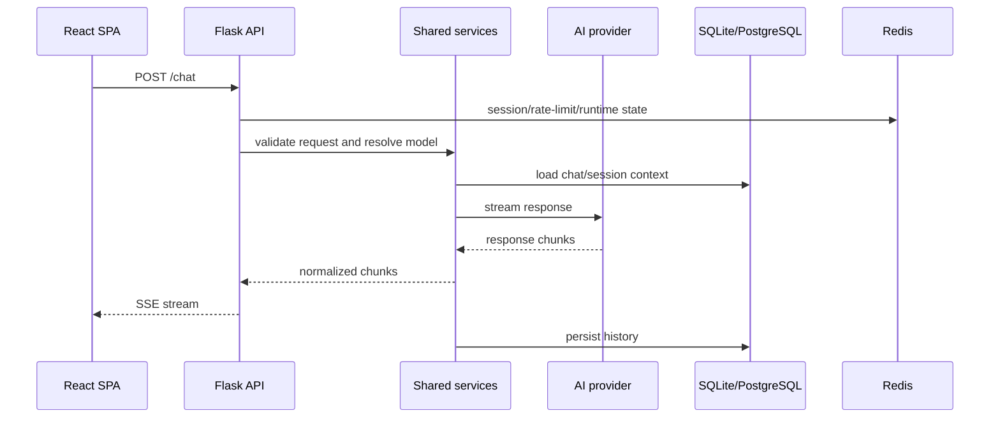

# Архитектура

ReMind организован как full-stack AI-продукт, а не как одиночный demo service. Главные границы такие:

- React/Vite отвечает за browser experience.
- Flask отвечает за API routing, security, sessions и static serving.
- Shared service modules держат business logic, который использует web API.
- Provider adapters в `ai_engine/` изолируют model-specific behavior.
- Redis и Celery отвечают за session/runtime infrastructure и background work.

## Runtime flow



## Основные модули

| Модуль | Ответственность |
|---|---|
| `app_factory.py` | Создает Flask app, настраивает CORS, sessions, CSRF, security headers, request context и route registration |
| `routes/api.py` | Регистрирует feature route groups в API blueprint |
| `routes/features/chat.py` | Chat endpoint и streaming response handling |
| `routes/features/sessions.py` | Session list/history management |
| `routes/features/share.py` | Public read-only chat links |
| `routes/features/privacy.py` | Export и deletion flows |
| `services/chat_history.py` | Persistence и retrieval chat history |
| `services/files.py` | File-related service behavior |
| `services/model_access.py` | Model access и selection rules |
| `services/voice.py` | Speech synthesis behavior |
| `routes/features/github.py` | Явный GitHub connection, repository и PR workflow |
| `services/github_oauth_flow.py` | Одноразовый encrypted OAuth credential flow в Redis |
| `ai_engine/gemini.py` | Gemini provider integration |
| `ai_engine/echo.py` | Local smoke-test provider |
| `ai_engine/demo_image.py` | Local image-flow smoke-test provider |

## API contract

Canonical OpenAPI schema:

```text
openapi/openapi.json
```

Generated TypeScript client:

```text
src/generated/openapi.ts
```

Проверка generated client:

```bash
npm run openapi:check
```

## Deployment shape

Production-like Compose запускает:

- Nginx как edge service.
- Flask app за Nginx.
- Celery worker для background jobs.
- PostgreSQL как primary database.
- Redis для sessions, queue broker и runtime cache.

Локальная разработка может использовать SQLite и локальный Redis, либо полный dev Compose stack.

## GitHub workflow

GitHub — отдельный workspace, а не скрытый перехват обычного сообщения в чате. Сначала клиент
запрашивает только connection snapshot из БД, затем по явному выбору installation загружает
репозитории и только после review плана запускает создание ветки и PR.

OAuth state хранится в Redis 10 минут, а короткоживущий GitHub access token — в зашифрованном
Redis record максимум 15 минут. В browser cookie хранится только непрозрачный flow ID. Для
production задайте отдельный `GITHUB_OAUTH_ENCRYPTION_KEY` в формате Fernet key; без него ключ
детерминированно выводится из `SECRET_KEY` как совместимый переходный вариант.
