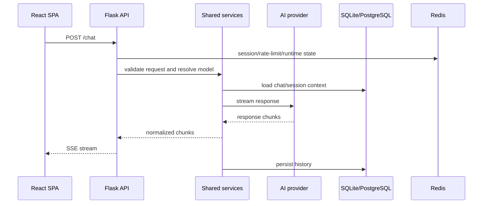

# Архитектура

ReMind организован как full-stack AI-продукт, а не как одиночный demo service. Главные границы такие:

- React/Vite отвечает за browser experience.
- Flask отвечает за API routing, security, sessions и static serving.
- Shared service modules держат business logic, который использует web API.
- Provider adapters в `ai_engine/` изолируют model-specific behavior.
- Redis и Celery отвечают за session/runtime infrastructure и background work.

## Runtime flow


```mermaid
sequenceDiagram
  participant Browser as React SPA
  participant API as Flask API
  participant Services as Shared services
  participant AI as AI provider
  participant DB as SQLite/PostgreSQL
  participant Redis as Redis

  Browser->>API: POST /chat
  API->>Redis: session/rate-limit/runtime state
  API->>Services: validate request and resolve model
  Services->>DB: load chat/session context
  Services->>AI: stream response
  AI-->>Services: response chunks
  Services-->>API: normalized chunks
  API-->>Browser: SSE stream
  Services->>DB: persist history
```

## Основные модули

| Модуль | Ответственность |
|---|---|
| `app_factory.py` | Создает Flask app, настраивает CORS, sessions, CSRF, security headers, request context и route registration |
| `routes/api.py` | Регистрирует feature route groups в API blueprint |
| `routes/features/chat.py` | Chat endpoint и streaming response handling |
| `routes/features/sessions.py` | Session list/history management |
| `routes/features/share.py` | Public read-only chat links |
| `routes/features/privacy.py` | Export и deletion flows |
| `services/chat_history.py` | Persistence и retrieval chat history |
| `services/files.py` | File-related service behavior |
| `services/model_access.py` | Model access и selection rules |
| `services/voice.py` | Speech synthesis behavior |
| `routes/features/github.py` | Явный GitHub connection, repository и PR workflow |
| `services/github_oauth_flow.py` | Одноразовый encrypted OAuth credential flow в Redis |
| `ai_engine/gemini.py` | Gemini provider integration |
| `ai_engine/echo.py` | Local smoke-test provider |
| `ai_engine/demo_image.py` | Local image-flow smoke-test provider |

## API contract

Canonical OpenAPI schema:

```text
openapi/openapi.json
```

Generated TypeScript client:

```text
src/generated/openapi.ts
```

Проверка generated client:

```bash
npm run openapi:check
```

## Deployment shape

Production-like Compose запускает:

- Nginx как edge service.
- Flask app за Nginx.
- Celery worker для background jobs.
- PostgreSQL как primary database.
- Redis для sessions, queue broker и runtime cache.

Локальная разработка может использовать SQLite и локальный Redis, либо полный dev Compose stack.

## GitHub workflow

GitHub — отдельный workspace, а не скрытый перехват обычного сообщения в чате. Сначала клиент
запрашивает только connection snapshot из БД, затем по явному выбору installation загружает
репозитории и только после review плана запускает создание ветки и PR.

OAuth state хранится в Redis 10 минут, а короткоживущий GitHub access token — в зашифрованном
Redis record максимум 15 минут. В browser cookie хранится только непрозрачный flow ID. Для
production задайте отдельный `GITHUB_OAUTH_ENCRYPTION_KEY` в формате Fernet key; без него ключ
детерминированно выводится из `SECRET_KEY` как совместимый переходный вариант.

## Промпты, навыки и выполнение инструментов

Единый реестр `ai_engine/skills.py` задаёт ID навыка, его Markdown-ресурс, функции и правило доступа. `services/skill_access.py` разрешает доступ для текущего аккаунта, канала и запроса. Этот же результат используется каталогом `/api/models`, сборщиком промпта и исполнительной средой: наличие пункта в интерфейсе не даёт дополнительных прав.

`ai_engine/prompt_builder.py` собирает базовые правила, ограниченные пользовательские настройки, каталог возможностей и текущий контекст. Полные инструкции лежат в `ai_engine/skills/<id>/SKILL.md`. Выбранные навыки загружаются сразу; остальные модель запрашивает через `read_skill`. Загрузка разрешена только по ID из реестра. Пути из пользовательского текста, файлов и репозиториев не используются. Отсутствующий обязательный ресурс останавливает запрос вместо молчаливой отправки неполного промпта. Файлы перечитываются для нового запроса, а внутри одного запроса сохраняется согласованная версия уже загруженных инструкций.

Схемы функций хранятся в `ai_engine/tool_schemas.json`. `services/model_runtime.py` формирует разрешённый набор схем, проверяет вызов перед выполнением и требует загрузить соответствующий навык. Google-адаптер в `ai_engine/gemini.py` отвечает за SDK, поток ответа и ограниченный цикл вызовов. Результаты функций и лимиты определены в `services/tool_protocol.py`.

| Исполнитель | Назначение |
|---|---|
| `services/model_tools.py` | Веб-поиск, изолированный Python, чтение GitHub и анализ изображений |
| `services/presentation_tools.py` | Публикация визуализаций, виджетов и документов Canvas |
| `services/canvas_tools.py` | Работа с документом и совместимость с историческими canmore-ответами |
| `ai_engine/output_contract.py` | Обнаружение неподдерживаемого формата перед выдачей финального текста |

`render_visualization` принимает HTML-фрагмент или точное имя файла, уже доступного текущему запросу. Сервер не открывает `/tmp/...`, URL или произвольный путь из аргументов модели. Файл проходит существующую проверку принадлежности каталогу загрузок. Размер и формат ограничены; отображение остаётся внутри существующего iframe без доступа к origin приложения. `canvas_write` создаёт документ либо заменяет текущий с сохранением ID. `render_widget` проверяет поддерживаемый формат и JSON-контракт перед передачей существующим клиентским рендерам. Успех публикации не означает выполнение JavaScript, тестирование продукта или развёртывание — это явно указано в результате функции.

Неподдерживаемые локальные ссылки на визуализации и выдуманный транспорт не показываются пользователю как готовый результат. Адаптер допускает до двух исправлений в рамках общего бюджета вызовов, после чего завершает запрос ошибкой. Неуспешный вызов можно повторить после исправления или загрузки навыка; успешные дубликаты блокируются по хешу полных аргументов, а не их усечённого представления.

GitHub-функции чата предоставляют чтение подключённых репозиториев. Создание репозитория и публикация в него не входят в этот контракт. Отдельный GitHub workspace сохраняет существующий явный процесс планирования, подтверждения и выполнения изменений. Демонстрационный Image вызывается через `generate_demo_image` в том же цикле, не переключая весь запрос на отдельную модель. Он доступен только соответствующим внутренним аккаунтам, остаётся тестовым генератором и не объявляется полноценной генерацией визуальных ассетов.

Для добавления навыка нужны запись в реестре, `SKILL.md`, схема функции и обработчик с проверкой доступа. После изменения проверяются каталог, состав промпта, отказ для недоступных функций, публикация в SSE и история, а также отображение результата на ширине 320px. Инструкции внешней платформы нельзя переносить без адаптации к фактическим функциям ReMind.

Клиент разбирает маркеры виджетов в `src/features/chat/messagePresentation.ts` из сохранённого форматированного содержимого. Разбор не читает и не изменяет уже отображённый DOM. Результат детерминирован для одного сообщения; потоковые обновления накладываются отдельно со стабильным ID. Это сохраняет визуализации при повторном рендере React, переключении темы и загрузке истории.
